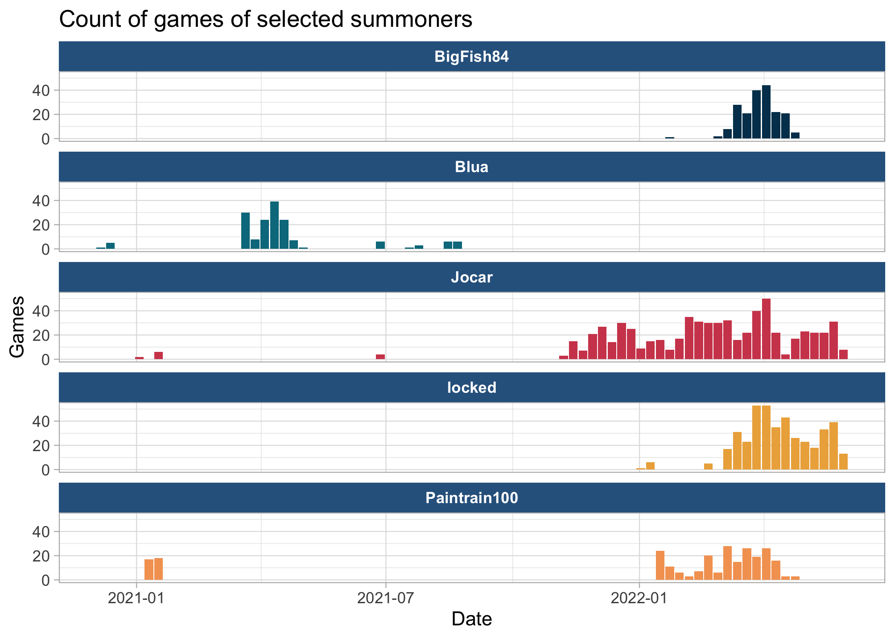
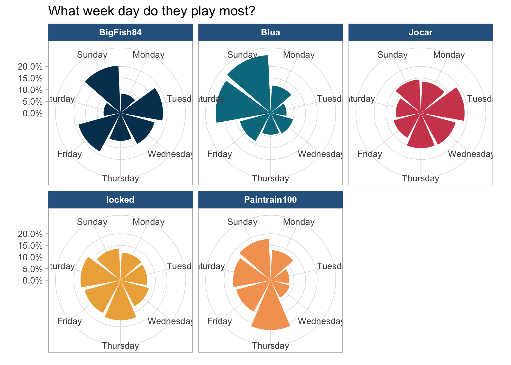
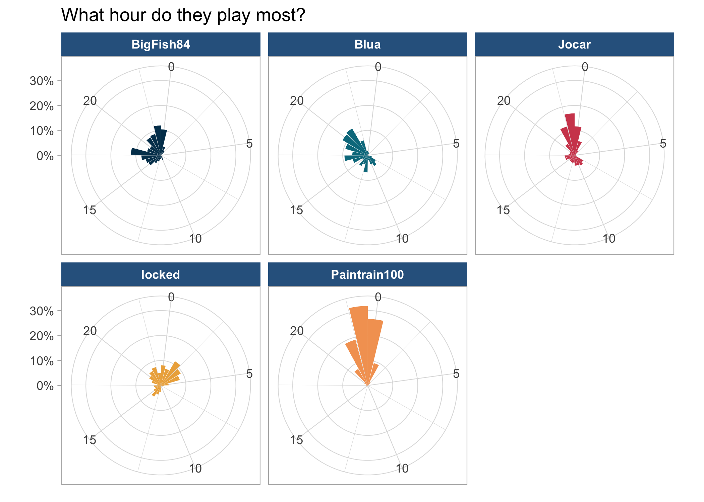
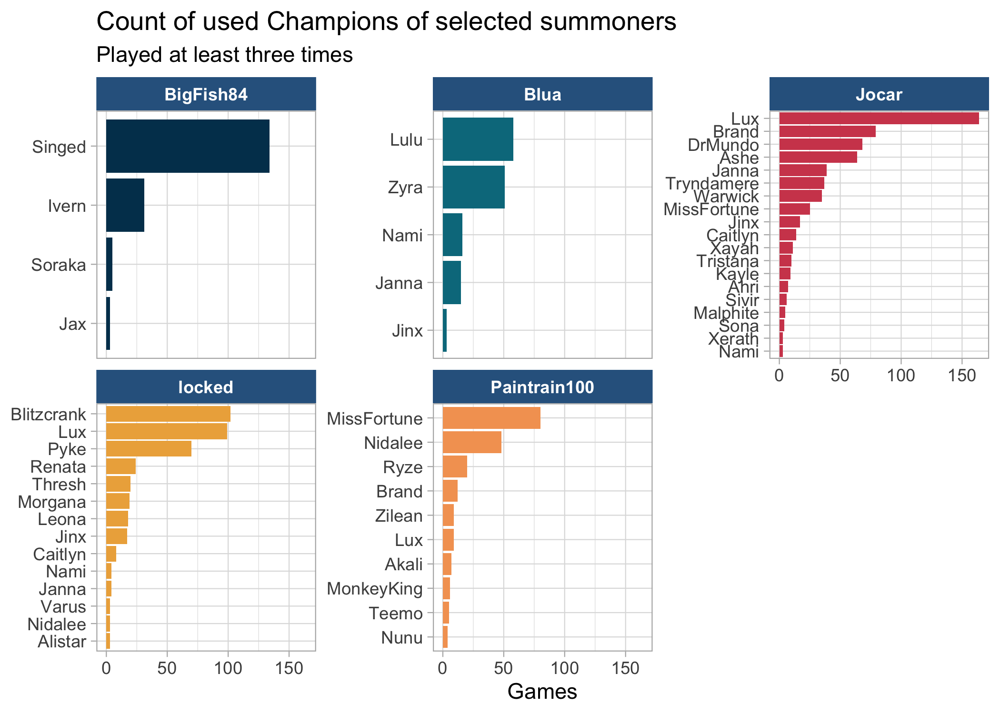
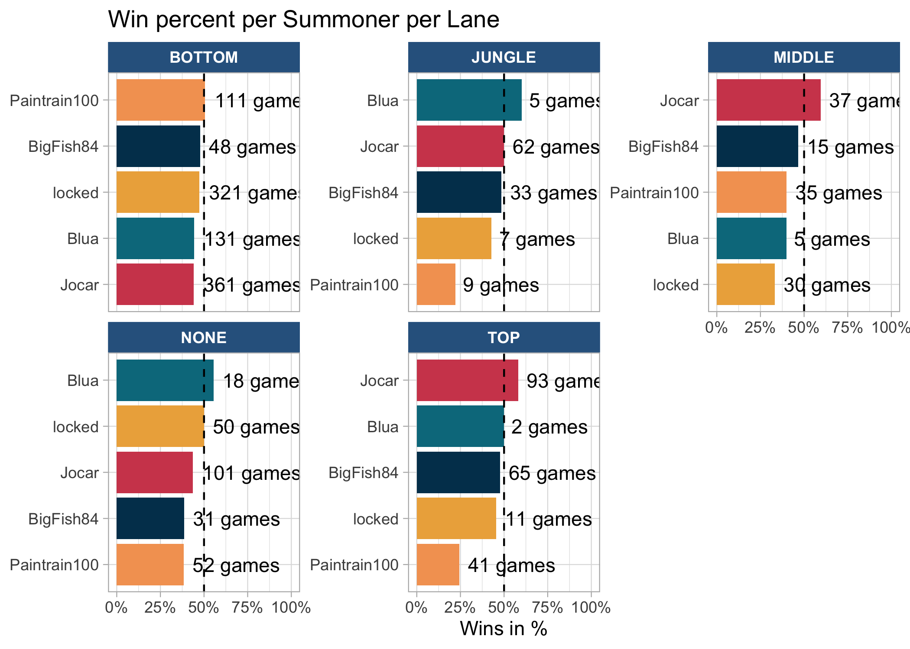
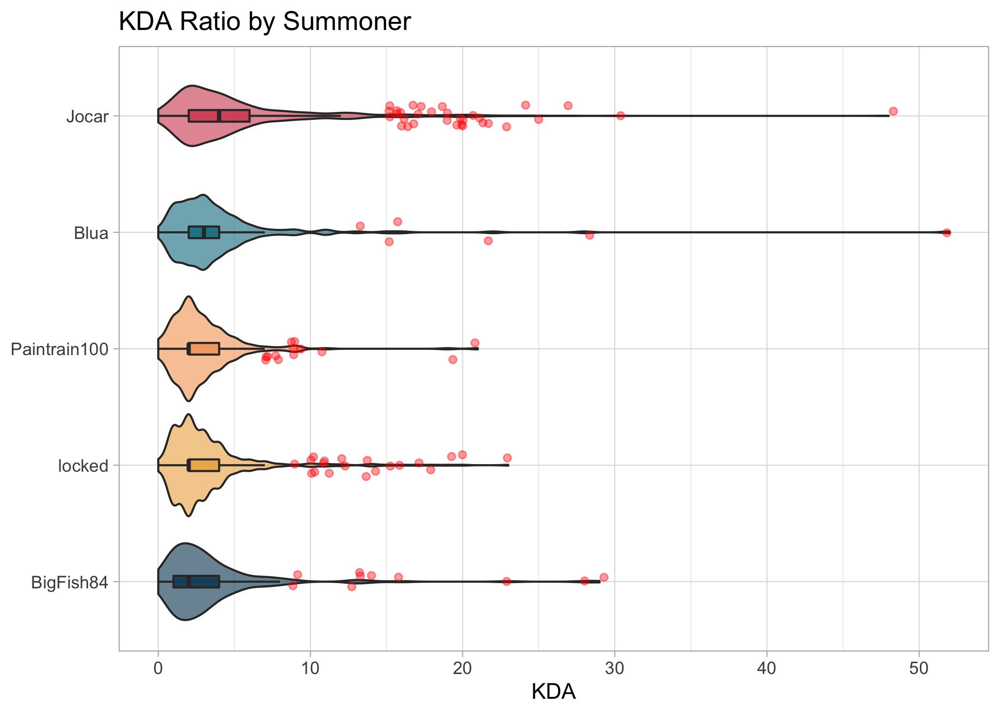

<!-- README.md is generated from README.Rmd. Please edit that file -->

# LOL Exploration

<!-- badges: start -->
<!-- badges: end -->

The goal of LOL Exploration is to …

<!-- --><!-- --><!-- --><!-- --><!-- --><!-- --><!-- -->
